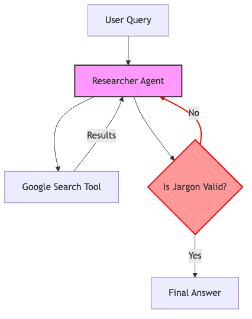
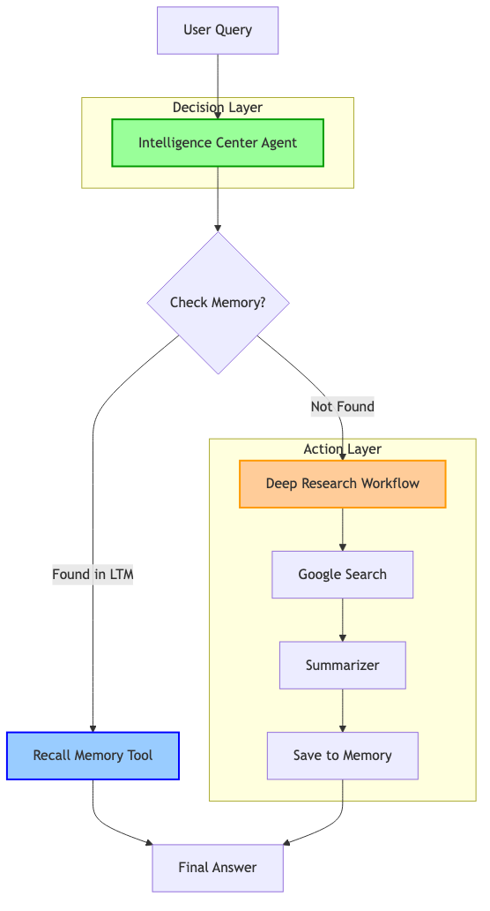
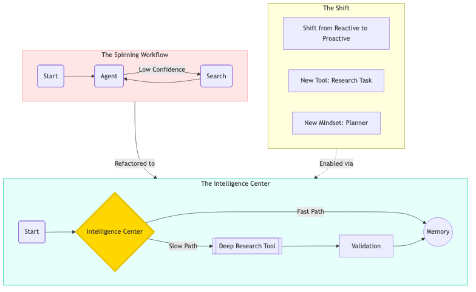

# Agent Evaluation Journey & Reference

> **Status:** ✅ Functional | **Pipeline:** 100% Passing | **Models:** Gemini Flash / Live

This document serves as an "honest readme" regarding the evolution of our agent evaluation pipeline, from initial failures to a robust, three-tier testing strategy.

## 1. The Challenge: Mixed Tools & Modern Models
We initially encountered critical failures when upgrading to **Gemini 2.5 Flash**. The core issue was a strict constraint in the new model architecture: **It does not support mixing Google Search citations with other function calls in the same turn.**

### The Fix: Split & Sequencing
To resolve the `ClientError: 400 INVALID_ARGUMENT (Mixed Tools)`, we refactored the monolithic `ResearcherAgent` into two specialized components:
1.  **`SearchAgent`**: Dedicated solely to using the `google_search` tool. It outputs raw search results.
2.  **`ResearchAnalysisAgent`**: Dedicated to "thinking". It takes the search results as *input* (context) and uses internal tools/logic to synthesize an answer.
3.  **`SequentialAgent`**: Orchestrates them (`Search -> Analysis`), ensuring the model never sees conflicting tool definitions in a single context.

## 2. The Solution: Agent Testing Pyramid
To "stretch" our evaluation and ensure reliability beyond just "it didn't crash", we implemented the **Agent Testing Pyramid**.

### Tier 1: Component-Level Unit Tests 🧪
*   **Goal**: Ensure individual agents are configured correctly and select the right tools in isolation.
*   **Implementation**: `pilot/tests/test_search_agent.py` & `test_analysis_agent.py`.
*   **What Works**: We now verify that `SearchAgent` has the correct instructions and tool definitions without needing to run the full expensive pipeline.

### Tier 2: Trajectory-Level Integration Tests 🛤️
*   **Goal**: Verify the agent *behaves* correctly, not just that it produced *an* answer.
*   **Implementation**: 
    *   Updated `evaluation_dataset.json` to include `"expected_tool_sequence": ["MainWorkflowAgent"]`.
    *   Updated `benchmark_prompts.py` to trace the execution path.
*   **Metric**: `trajectory_score`. We require a score of **0.8+** (along with semantic similarity) to pass. This catches cases where the agent might hallucinate an answer without actually using the required tools.

### Tier 3: End-to-End Human Review 👁️
*   **Goal**: Allow humans to inspect the reasoning process for complex queries.
*   **Implementation**: `pilot/evaluation/human_review.py`.
*   **Result**: Each run generates a clean Markdown report in `pilot/evaluation_reports/` containing the full Q&A trace, tool usage, and scores. This is uploaded as a **CI Artifact** (`human-review-reports`) for easy inspection.

## 3. Architecture Evolution & Metamorphosis 🦋

Our agent architecture has undergone a significant metamorphosis to address the "infinite loop" problem and optimize for cost/latency.

### 📜 Phase 1: The "Spinning" Researcher (Legacy)
Initially, the agent was a **Reactive** entity. It blindly entered a research loop for every query.
*   **The Flaw**: When validating jargon-heavy queries (e.g., "activate RACE START"), the validator would reject imperfect answers, forcing the agent to research again and again—spinning indefinitely.
*   **The Diagram**:


### 🧠 Phase 2: The Intelligence Center (Modern)
We re-architected the system into a **Predictive** "Intelligence Center". The agent now acts as a Planner, routing queries based on knowledge state.
*   **The Fix**: A **Memory-First** strategy.
    1.  **Recall**: The agent *must* check Long-Term Memory (Vertex AI) first. If the answer exists, it returns immediately (0 searching cost).
    2.  **Research**: Only if memory misses does it deploy the heavy `DeepResearchWorkflow` tool.
*   **The Diagram**:


### 🔄 The Metamorphosis
This shift transforms the agent from a simple tool-user to a state-aware orchestrator.
### 👁️ Phase 3: Multimodal Co-Pilot ("Alora")
We further evolved the architecture to handle **Vision** capabilities while maintaining the strict tool definitions of the backend agents.
*   **The Challenge**: The `IntelligenceCenterAgent` and its tools (Search, Research) are text-based and "blind" to images.
*   **The Flow**: The **Orchestrator (Alora)** acts as the vision layer.
    1.  **See**: Alora receives the user's image + query.
    2.  **Describe**: Alora generates a high-fidelity text description of the image (colors, objects, text).
    3.  **Delegate**: Alora passes this *description* + the original query to the `IntelligenceCenterAgent`.
    4.  **Solve**: The backend agents research the *concept* of the image (e.g., specific car part) without needing raw pixel access.



## 4. Security & Guardrails (Model Armor) 🛡️
We integrated **Google Cloud Model Armor** to sanitize inputs before they ever reach our agent logic.
*   **Mechanism**: A `before_model_callback` intercepts every request.
*   **Filters**: We use the `alora-ma-template` which enforces:
    *   **PII Detection**: Blocks sharing sensitive personal info.
    *   **Jailbreak/Attack**: Prevents prompt injection attempts.
    *   **Malicious URIs**: Filters unsafe links.
*   **Result**: If a thread is detected, the prompt is scrubbed and replaced with a system refusal instruction, protecting the LLM context.

## 5. Current Limitations (The "Honest" Part)
*   **Monte Carlo Tree Search (MCTS)**: While intended to be part of the advanced planning capabilities, the MCTS component is currently **not fully functional** and disabled in the active evaluation path. We are relying on the deterministic `SequentialAgent` flow for now.
*   **Dependency Speed**: The `sentence-transformers` library (used for similarity scoring) is heavy. We implemented a robust fallback to a mock scorer if the download times out, ensuring the pipeline doesn't flake due to network issues, but this means local runs might sometimes skip semantic verification if the environment isn't cached.

## How to Run

### Local Server Development
You can run the pilot server locally for development.

**Option 1: Standard Run (Fast & Simple)**
Use this for quick logic iteration.
```bash
cd pilot
# Run via Uvicorn module
uv run python -m uvicorn main:app --host 0.0.0.0 --port 8080 --reload
```

**Option 2: With Datadog Tracing (Full Observability)**
Use this to debug traces and LLM Observability spans locally.
```bash
cd pilot
# Run with ddtrace wrapper
export DD_SERVICE=pilot
export DD_ENV=local
uv run ddtrace-run uvicorn main:app --host 0.0.0.0 --port 8080 --reload
```

### Evaluation Suite
```bash
# Full Suite (Tiers 1-3)
cd pilot
uv run python -m pytest evaluation/test_evaluation_pipeline.py
```
*Environment variables `AGENT_MODEL=gemini-2.5-flash` and `INTERNAL_MODEL=gemini-2.5-flash` should be set (or configured in .env).*


